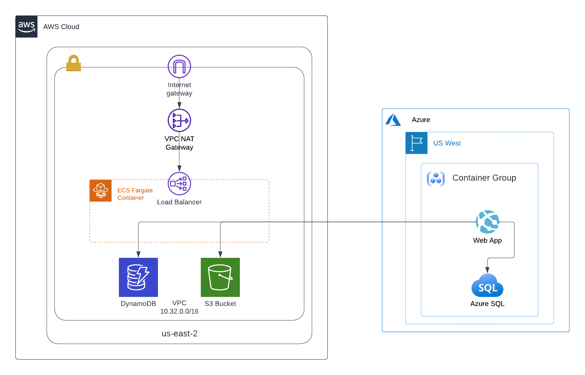
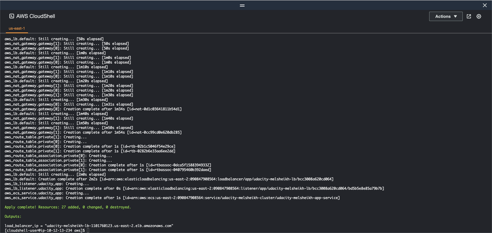
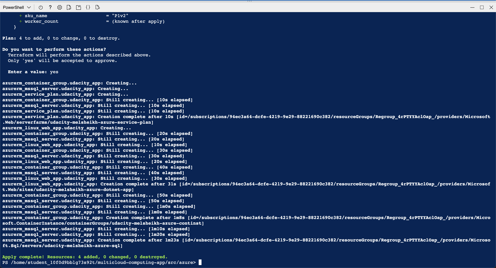
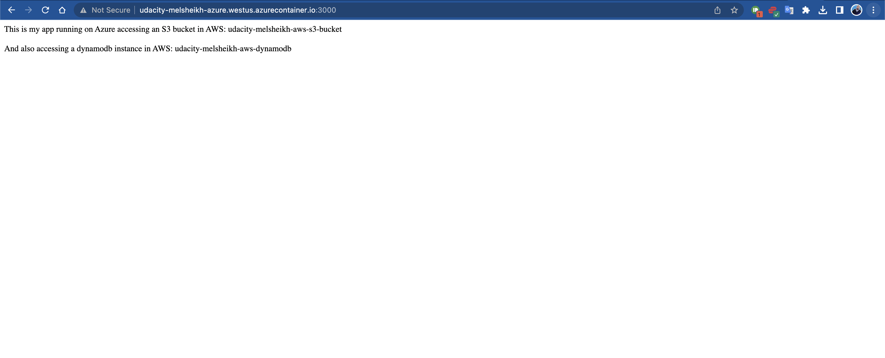
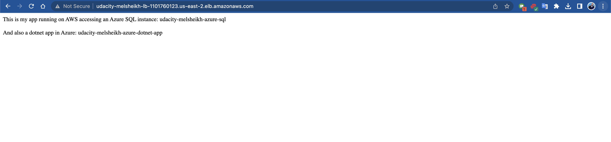

# A Multi-Cloud Application

## Getting Started

This folder contains the Terraform code to deploy your project. Appropriate cloud providers is selected. The choice of cloud provider may depend on your specific business needs and priorities. 

### Resources
See the documentation here:
- For [Azure](https://registry.terraform.io/providers/hashicorp/azurerm/latest/docs)
- For [AWS](https://registry.terraform.io/providers/hashicorp/aws/latest/docs)

### Dependencies

```
- Terraform
- Azure access
- AWS access
```

### Installation

1. Install Terraform, and pull a fresh copy of the github repository into both AWS and Azure Cloud Shells. In each shell, run the following:

    For AWS:
    
    1. Open AWS Cloud Shell
    2. Run the following commands to install Terraform:
        1. `sudo yum install -y yum-utils`
        2. `sudo yum-config-manager --add-repo https://rpm.releases.hashicorp.com/AmazonLinux/hashicorp.repo`
        3. `sudo yum -y install terraform`

    3. Clone terraform code
        ```
        cd ~
        git clone git@github.com:Sasa94s/multicloud-computing-app.git
        ```
    4. Navigate to terraform directory
        ```
        cd multicloud-computing-app/src/aws/
        ```
    5. Initialize terraform working directory
        ```
        terraform init
        ```
    For Azure:

    1. Open Azure Cloud Shell
        1. Select PowerShell when prompted. Then click Show advanced settings on the next screen
        2. Leave the resource group selected. 
            - Name your storage account `udacitymelsheikh` all lowercase with no dashes or punctuation. 
            - Name file share `melsheikhfileshare` less than 24 characters. 
            - Click Create.
            - Allow the console to provision. 
    2. Navigate to terraform directory
        ```
        cd ~/multicloud-computing-app/src/azure/
        ```
    3. Initialize terraform working directory
        ```
        terraform init
        ```


## Project Instructions

### Requirements
Your goal is to select a cloud provider for each of the 4 required services - SQL server, S3 storage, web app and NoSQL database. Also don't forget to consider cost and flexibility of pricing options.

1. Select a cloud provider for SQL server
    1. Must utilize at least 2 vCPU
    2. 150GB of storage
    3. We will be migrating an existing SQL server instance
    4. We would like to bring our own SQL licensing
2. Select a cloud provider for S3 storage
    1.  Must have full S3 API capability
    2.  Global replication
3. Select a cloud provider for the NoSQL database
    1. Global availability
    2. Highly scalable pricing
4. Select a cloud provider for the Web app
    1. Existing dotnet application (note this is NOT a static website)

### Solution



#### Service Selection
1. **Azure is recommended for SQL Server hosting**, offering cost-effective options and flexible pricing for compute and storage, as well as support for migrating existing instances and bring-your-own-license (BYOL) options.
2. **AWS is the recommended choice for S3 storage**, offering the most comprehensive object storage service with full S3 API capabilities, global replication, scalability, and flexible pricing options with a variety of storage classes to choose from.
3. **AWS is also recommended for NoSQL databases**, offering a variety of options such as DynamoDB, a highly scalable and fully managed NoSQL database service with built-in multi-region replication, automatic scaling, and flexible pricing options based on read/write capacity and data storage usage.
4. **Azure is recommended for hosting .NET web applications**, with options such as Azure App Service and Azure Functions. Azure App Service provides a fully managed platform for hosting web apps, while Azure Functions offers serverless hosting for event-driven applications, helping to reduce costs and improve scalability.

#### Cost Selection
| Service | **Azure Pricing** | **AWS Pricing** | **Choice** |
|---|---|---|---|
| **SQL Server** | Starting from $0.016 per vCore hour and $0.10/GB/month for storage, with BYOL licensing available | Starting from $0.017 per vCPU hour and $0.115/GB/month for storage, with BYOL licensing available | Azure |
| **S3 Storage** | Starting from $0.023/GB/month for standard storage | Starting from $0.023/GB/month for standard storage | AWS |
| **NoSQL Database** | Starting from $1.50 per million operations/month | Starting from $1.25 per million operations/month | AWS |
| **Web App** | Starting from $0.0188/hour for Windows App Service Plan with 2 vCPUs and 3.5GB RAM, with auto-scaling available | Starting from $0.10/hour for Elastic Beanstalk with 2 vCPUs and 4GB RAM, with auto-scaling available | Azure |
|  |  |  |  |

### Instructions

1. Verify terraform infrastructure changes. In each shell, run the following:

    For AWS:
    ```
    cd ~/multicloud-computing-app/src/aws/
    terraform plan
    ```

    For Azure:
    ```
    cd ~/multicloud-computing-app/src/azure/
    terraform validate
    ```
2. Apply terraform infrastructure changes. In each shell, run the following:

    For AWS:
    ```
    cd ~/multicloud-computing-app/src/aws/
    terraform apply
    ```

    

    For Azure:
    ```
    cd ~/multicloud-computing-app/src/azure/
    terraform apply
    ```
    
    

    And type `yes` and enter when asked if you want to apply the changes
3. Verify the changes took effect:

    For Azure:
    1. In Azure go the search bar and type `container-instances` and click the icon that comes up
    2. Click `udacity-melsheikh-azure-continst`
    3. Copy the URL from the field FQDN
    4. Paste that URL into another tab in your browser and add `:3000` onto the end of the URL. It will look something like this: `udacity-melsheikh-azure.westus.azurecontainer.io:3000`. Go to that URL. You should see this text in your browser (note the name will be yours):

                This is my app running on Azure accessing an S3 bucket in AWS: udacity-melsheikh-aws-s3-bucket

                And also accessing a dynamodb instance in AWS: udacity-melsheikh-aws-dynamodb
    
    

    For AWS:
    1. In AWS go the search bar and type `load balancer` and click Load Balancers under the EC2 heading
    2. Click `udacity-melsheikh-lb`
    3. Copy the URL from the field DNS
    4. Paste that URL into another tab in your browser. It will look something like this: `udacity-melsheikh-lb-1101760123.us-east-2.elb.amazonaws.com`. Go to that URL. You should see this text in your browser (note the name will be yours):

                This is my app running on AWS accessing an Azure SQL instance: udacity-melsheikh-azure-sql

                And also a dotnet app in Azure: udacity-melsheikh-azure-dotnet-app

    

    **Note:** Output samples can be found [here](./src/README.md)

#### Troubleshooting Tips:
- In AWS you may only be able to run 1 or 2 exercises at a time. If you get an error in the AWS console about not having enough space or out of space, please run the following commands:
    - `cd ~`
    - `rm -rf *`

- In Azure, you may receive an error when provisioning your cloud console similar to "Storage Account Creation Failed" or "Authorization Failed". This is likely because you did not select the pre-created resource group from the lab. The pre-created resource group is already selected and is required for the labs. The pre-created resource group name will be similar to `Regroup_4hEF_2G`. When provisioning your cloud console, first select `Show advanced settings`, then ensure you leave the resource group as the default.

- In Azure, you may receive an error when running terraform about resource group creation failed. This is likely because you did not change the resource group name in the `main.tf` file to reflect your unique resource group name the Azure labs assign you. The resource group name will look similar to this: `Regroup_4hEF_2G`

## License

[License](LICENSE.txt)
