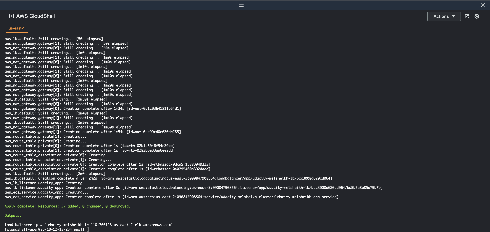
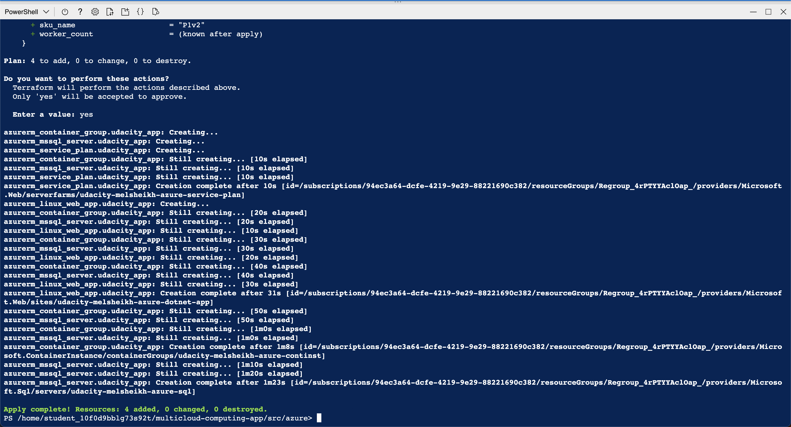
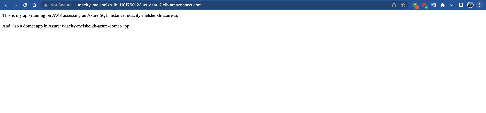

# Purpose of this Folder

This folder should contain the project files to apply infrastructure changes as a solution to the required services.

## Solution

## Output of `terraform apply`

### AWS

### Azure

## Test and Validation

### AWS Load Balancer

### Azure Container Service

